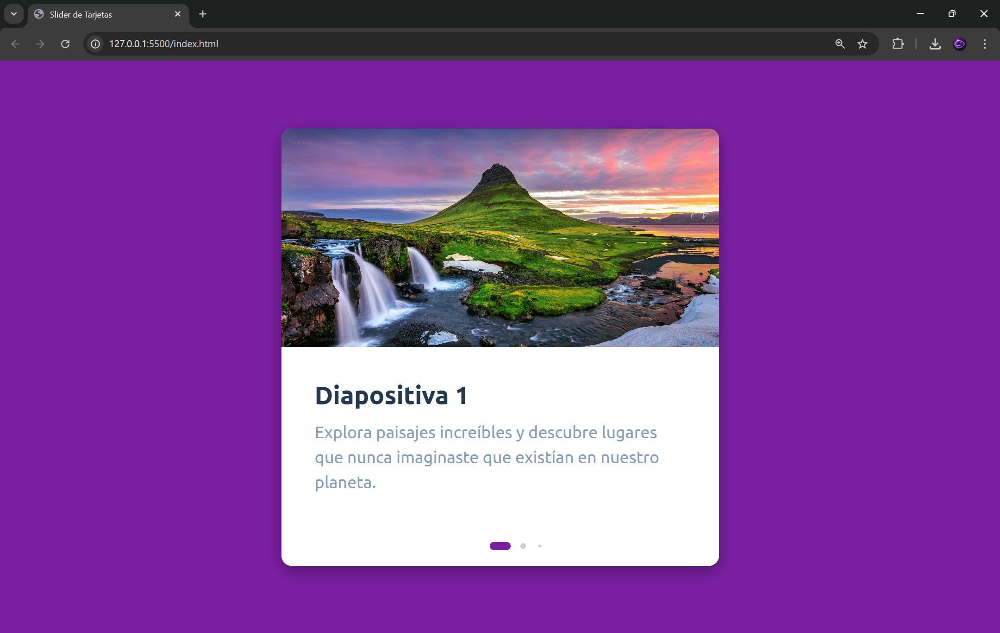

Slider de Tarjetas Animado 🎴
Un componente de slider moderno y responsivo construido con HTML5, CSS3 y Swiper.js. Este slider presenta un efecto de transición "Fade" (desvanecimiento) con animaciones de entrada para el contenido de texto.

✨ Características
Efecto Fade: Transiciones suaves entre diapositivas.

Animaciones de Texto: El título y la descripción aparecen con un efecto de desplazamiento hacia arriba al activar la diapositiva.

Totalmente Responsivo: Adaptado para dispositivos móviles, tablets y escritorio.

Navegación Flexible: Control mediante botones (Anterior/Siguiente), paginación dinámica y rueda del ratón (mousewheel).

Diseño Limpio: Estética minimalista utilizando la fuente 'Ubuntu'.

🛠️ Tecnologías Utilizadas
HTML5: Estructura semántica.

CSS3: Estilos personalizados, Flexbox y animaciones de transición.

JavaScript (ES6): Lógica de inicialización.

Swiper.js (v11): Biblioteca principal para la funcionalidad del slider.

Google Fonts: Fuente 'Ubuntu'.

🚀 Instalación y Uso
Clona el repositorio o descarga los archivos:

Bash
git clone https://github.com/tu-usuario/nombre-del-repo.git
Asegúrate de tener las imágenes:
Coloca tus imágenes en la carpeta raíz y nómbralas como 1.jpg, 2.jpg, 3.jpg y 4.jpg (o actualiza las rutas en el index.html).

Abre el proyecto:
Simplemente abre el archivo index.html en tu navegador preferido.

📁 Estructura del Proyecto
Plaintext
├── index.html   # Estructura del slider y carga de CDNs
├── style.css    # Estilos, animaciones y diseño responsivo
├── script.js   # Configuración y parámetros de Swiper.js
└── README.md    # Documentación del proyecto
⚙️ Configuración de Swiper.js
El slider está configurado en script.js con los siguientes parámetros clave:

JavaScript
const swiper = new Swiper('.swiper-container', {
    effect: 'fade',      // Efecto de desvanecimiento
    loop: true,          // Bucle infinito
    speed: 500,          // Velocidad de transición (ms)
    mousewheel: true,    // Control con el ratón
    pagination: {
        clickable: true,
        dynamicBullets: true // Puntos de navegación dinámicos
    }
});
🎨 Personalización
Colores: Puedes cambiar el color de fondo principal modificando la propiedad background en el body dentro de style.css.

Dimensiones: El tamaño máximo de la tarjeta se ajusta en la clase .swiper-container (max-width y height).

# 📷 Imagen

# 🌐 Sitio Web
https://modern-card-swart.vercel.app/